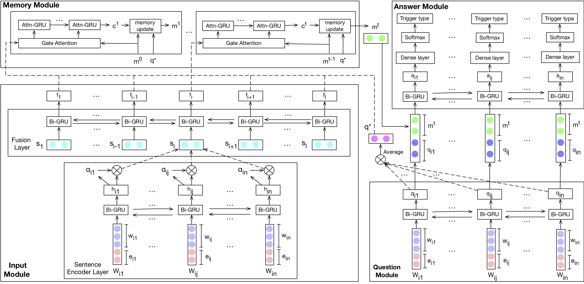

# TD-DMN

The PyTorch implementation of our EMNLP18 short paper *Exploiting Contextual
Information via Dynamic Memory Network for Event Detection*.

### Processed Data

Due to license reason, the ACE 2005 dataset is only accessible to those with **LDC2006T06** license,
please drop me an email showing your possession of the license for the processed data.

### Quick Start
``./run.sh``

### Requirements
The required external packages can be installed using ``pip install -r requirements.txt``.