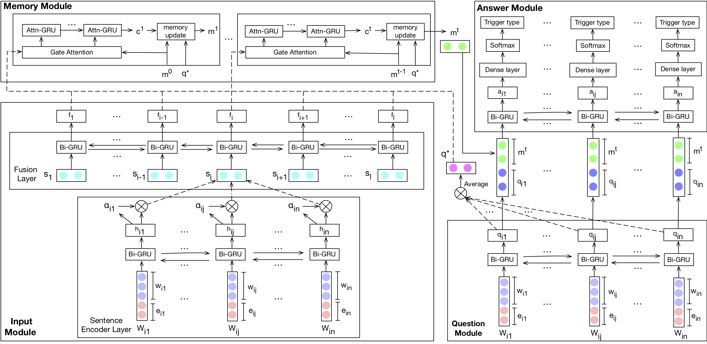
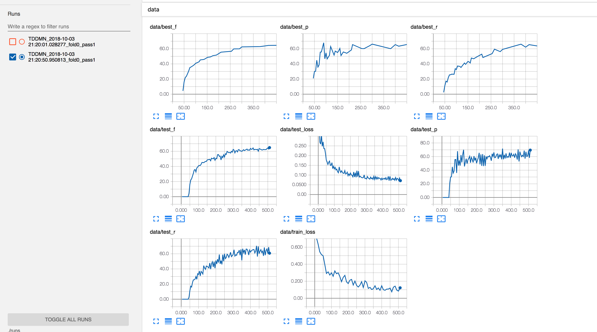

# TD-DMN

The PyTorch implementation of our EMNLP18 short paper [*Exploiting Contextual
Information via Dynamic Memory Network for Event Detection*](https://liushaobo.me/assets/pdf/emnlp18.pdf).



### Processed Data
Due to license reason, the ACE 2005 dataset is only accessible to those with **LDC2006T06** license,
please drop me an email showing your possession of the license for the processed data.

### Requirements
``Python 3.6.2`` is used while building the TD-DMN model, other versions of python are not tested.
Use ``pip install -r requirements.txt`` to install required external packages.

### Quick Start
```bash
python train.py --fold_num=0 --identifier="TDDMN" --max_train_epoch=200 --patience=96 \
                --tensorboard_log_dir="./runs" --result_log_dir="./results" --data_dir="./data" \
                --vec_name="GoogleNews-vectors-negative300.txt" --vec_cache=".vector_cache/"
 ```
 
 Before running the above command, processed data files and pre-trained word vectors should be in place under
 ``--data_dir`` and ``--vec_cache`` respectively. Meanings of arguments:
 
```
  --identifier IDENTIFIER
                        an identifier string that describes the model
  --fold_num FOLD_NUM   dictates which fold to use
  --max_train_epoch MAX_TRAIN_EPOCH
                        maximum training epoch in training loop
  --patience PATIENCE   epochs to wait before seeing new lowest test loss or
                        new highest test f
  --tensorboard_log_dir TENSORBOARD_LOG_DIR
                        path directory of tensorboard log files
  --result_log_dir RESULT_LOG_DIR
                        path directory of model results log files
  --data_dir DATA_DIR   path directory of processed data
  --vec_name VEC_NAME   name of the pre-trained vector
  --vec_cache VEC_CACHE
                        path to word vector file and its cache
```
### Viewing Results
The program writes two types of logs. The tensorboard logs summarizing training statistics are under 
``--tensorboard_log_dir`` and the model results logs are under ``--result_log_dir``. To view tensorboard
logs, run ``tensorboard --logdir=tensorboard_log_dir`` and open ``http://localhost:6006`` in your browser. 



The model results logs are plain text files and can be viewed with text editors.


### Acknowledgement
The TD-DMN model is based on this [implementation](https://github.com/dandelin/Dynamic-memory-networks-plus-Pytorch) 
of Dynamic Memory Network plus. We use [torchtext](https://github.com/pytorch/text) as the data loader which is
pretty awesome, though the documentation is relatively scarce.